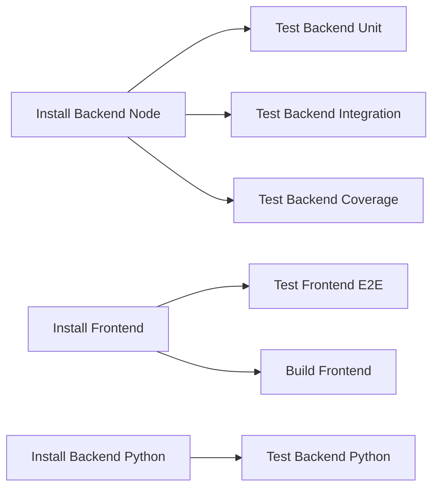

# 🚀 Guide d'automatisation des tests sur GitLab

Ce guide explique comment utiliser et configurer la pipeline GitLab CI/CD pour automatiser vos tests.

## 📋 Vue d'ensemble

Le fichier `.gitlab-ci.yml` à la racine du projet automatise :

- ✅ **Tests unitaires** du backend Node.js (Jest)
- ✅ **Tests d'intégration** du backend Node.js (Jest)
- ✅ **Tests e2e** du frontend Vue.js (Cypress)
- ✅ **Tests Python** du backend Python (pytest)
- ✅ **Build** du frontend pour vérifier qu'il compile sans erreurs
- ✅ **Rapports de couverture** de code

## 🏗️ Structure de la pipeline

La pipeline est organisée en **3 stages** :

1. **Install** : Installation des dépendances (Node.js et Python)
2. **Test** : Exécution de tous les tests
3. **Build** : Compilation du frontend



## 🔧 Configuration requise sur GitLab

### 1. Pousser le fichier sur GitLab

Le fichier `.gitlab-ci.yml` doit être à la racine de votre repository :

```bash
git add .gitlab-ci.yml GITLAB_CI_GUIDE.md
git commit -m "🔧 Add GitLab CI/CD pipeline configuration"
git push origin main
```

### 2. Activer GitLab CI/CD

1. Allez sur votre projet GitLab
2. Naviguez vers **Settings** > **CI/CD**
3. Vérifiez que **CI/CD** est activé
4. (Optionnel) Configurez des **Runners** si vous n'utilisez pas les runners partagés

### 3. Variables d'environnement (optionnel)

Si votre projet nécessite des variables d'environnement secrètes :

1. Allez dans **Settings** > **CI/CD** > **Variables**
2. Ajoutez vos variables (ex: `DATABASE_URL`, `JWT_SECRET`, etc.)
3. Cochez **Masked** pour les secrets

## 🎯 Jobs de la pipeline

### Backend Node.js

| Job | Description | Commande locale équivalente |
|-----|-------------|------------------------------|
| `install:backend:node` | Installe les dépendances | `cd backend && npm install` |
| `test:backend:node:unit` | Tests unitaires uniquement | `cd backend && npm run test:unit` |
| `test:backend:node:integration` | Tests d'intégration uniquement | `cd backend && npm run test:integration` |
| `test:backend:node:coverage` | Tous les tests avec couverture | `cd backend && npm run test` |

### Frontend Vue.js

| Job | Description | Commande locale équivalente |
|-----|-------------|------------------------------|
| `install:frontend` | Installe les dépendances | `cd frontend && npm install` |
| `test:frontend:unit` | Tests unitaires (à configurer) | `cd frontend && npm run test:unit` |
| `test:frontend:e2e` | Tests Cypress end-to-end | `cd frontend && npx cypress run` |
| `build:frontend` | Compile le frontend | `cd frontend && npm run build` |

### Backend Python

| Job | Description | Commande locale équivalente |
|-----|-------------|------------------------------|
| `install:backend:python` | Crée venv et installe deps | `cd backend_python && pip install -r requirements.txt` |
| `test:backend:python` | Tests pytest (si configurés) | `cd backend_python && pytest` |

## 📊 Visualiser les résultats

### Dans l'interface GitLab

1. Allez sur **CI/CD** > **Pipelines**
2. Cliquez sur le pipeline que vous voulez voir
3. Visualisez les jobs (vert = succès, rouge = échec)

### Rapports de couverture

Les rapports de couverture sont automatiquement générés et disponibles dans :
- **CI/CD** > **Pipelines** > **Coverage**
- Les artifacts de chaque job

## 🛠️ Tester localement avant de pousser

Avant de pousser sur GitLab, vous pouvez tester localement :

### Backend Node.js
```bash
cd backend
npm install
npm run test           # Tous les tests avec couverture
npm run test:unit      # Tests unitaires seulement
npm run test:integration  # Tests d'intégration seulement
```

### Frontend Vue.js
```bash
cd frontend
npm install
npm run build          # Vérifier que le build passe
npx cypress run        # Tests e2e (optionnel)
```

### Backend Python
```bash
cd backend_python
python -m venv .venv
source .venv/bin/activate  # Linux/Mac
# ou
.venv\Scripts\activate     # Windows
pip install -r requirements.txt
pytest                 # Si configuré
```

## ⚡ Optimisations de performance

### Cache des dépendances

La pipeline utilise le cache GitLab pour :
- `node_modules/` (Node.js)
- `.venv/` (Python)

Cela accélère considérablement les builds suivants.

### Jobs conditionnels

Les jobs ne s'exécutent que si les fichiers concernés ont changé :
- Changements dans `backend/` → tests backend uniquement
- Changements dans `frontend/` → tests frontend uniquement
- Changements dans `backend_python/` → tests Python uniquement

## 🔍 Debugging

### Voir les logs d'un job

1. Cliquez sur le job qui a échoué
2. Lisez les logs pour identifier l'erreur
3. Corrigez localement et poussez

### Jobs qui échouent

Quelques raisons courantes :
- ❌ **Dépendances manquantes** : vérifiez `package.json` / `requirements.txt`
- ❌ **Tests qui échouent** : lancez les tests localement d'abord
- ❌ **Variables d'environnement** : ajoutez-les dans GitLab Settings
- ❌ **Timeout** : augmentez la durée dans le job ou optimisez les tests

### Permettre l'échec de certains jobs

Certains jobs ont `allow_failure: true` :
- `test:frontend:unit` (pas encore configuré)
- `test:frontend:e2e` (peut être flaky)
- `test:backend:python` (si pas de tests configurés)

Ils n'empêcheront pas la pipeline de passer même s'ils échouent.

## 📝 Personnalisation

### Modifier les versions Node.js ou Python

Dans `.gitlab-ci.yml`, modifiez les variables :

```yaml
variables:
  NODE_VERSION: "18"      # Changer ici
  PYTHON_VERSION: "3.11"  # Changer ici
```

### Ajouter des jobs supplémentaires

Exemple pour un job de linting :

```yaml
lint:backend:
  stage: test
  image: node:18-alpine
  needs:
    - install:backend:node
  script:
    - cd backend
    - npm run lint
  only:
    changes:
      - backend/**/*
```

### Configurer les notifications

1. Allez dans **Settings** > **Integrations**
2. Configurez Slack, Discord, ou email
3. Choisissez les événements (pipeline success/failed)

## 🎓 Bonnes pratiques

1. ✅ **Committez souvent** : pushez régulièrement pour avoir du feedback rapide
2. ✅ **Tests locaux d'abord** : exécutez les tests localement avant de pousser
3. ✅ **Gardez les tests rapides** : optimisez les tests lents
4. ✅ **Surveillez la couverture** : maintenez une bonne couverture de code
5. ✅ **Utilisez des branches** : testez les changements dans des branches feature

## 📚 Ressources supplémentaires

- [Documentation GitLab CI/CD](https://docs.gitlab.com/ee/ci/)
- [Documentation Jest](https://jestjs.io/)
- [Documentation Cypress](https://www.cypress.io/)
- [Documentation pytest](https://docs.pytest.org/)

## ❓ FAQ

### Q: Puis-je désactiver certains tests ?

Oui, commentez le job dans `.gitlab-ci.yml` ou ajoutez une condition `when: manual`.

### Q: Comment voir la couverture de code ?

La couverture s'affiche dans **CI/CD** > **Pipelines** et dans les artifacts du job `test:backend:node:coverage`.

### Q: Les tests sont trop lents, comment les accélérer ?

- Utilisez le cache (déjà configuré)
- Exécutez les tests en parallèle
- Optimisez les tests lents

### Q: Comment exécuter manuellement un job ?

1. Dans la pipeline, cliquez sur le job
2. Cliquez sur le bouton **Play** (▶️)

---

**Bon tests automatisés ! 🎾**
